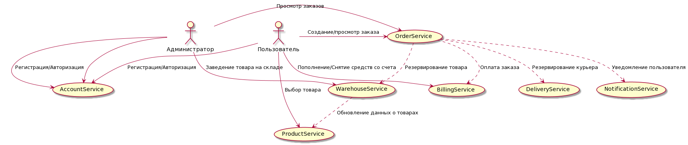

# Проект. Онлайн-магазин.

Цель.
1) Покупатель заходит на сайт и видит список товаров, которые он может приобрести.
2) После или перед выбором товаров, покупатель регистрируется на сайте.
3) Оформление заказа. Оплата заказа.

## Пользовательские сценарии

### Сторона покупателя

* Поиск товара по категориям
* Фильтрация товара по атрибутам
* Добавление товаров к корзину
* Оформление/вход в личный кабинет на сайте
* Возможность посмотреть историю заказов/оплаты
* Внесение/Снятие необходимой суммы на/с депозита
* Получать сообщение о подтверждении заказа
* Получать сообщение о курьере

### Сторона администратора

* Просмотр истории заказов/оплаты клиентов
* Просмотр истории заказов курьеров
* Просмотр истории уведомлений
* Поиск курьера для заказа

## Сервисы

* Product Service
* Account Service
* Order Service
* Notification Service
* Warehouse Service
* Billing Service
* Delivery Service

### Взаимодействие сервисов

#### Общая схема взаимодействия

#### Схемы взаимодействия

[Схемы взаимодействия](ServiceInteraction/Readme.md)

## Описание сервисов

### Product Service
Сервис отвечает за предоставление товаров пользователю на витрине, где он может выбрать товар для покупки.

* Функции:
    * Api:
		* Получение списка товаров по фильтрам
* Зависимости:
    * Warehouse Service - чтение топика по товарам на складах

### Account Service
Сервис управления пользователями.

- Хранит информацию о пользователе.
- Служит сервисом авторизации и аутентификации.

* Функции:
	* Api:
		* Регистрация нового профиля пользователя
		* Изменение профиля
		* Получение JWT токена авторизации
	* События:
		* Добавлен профиль
		* Обновлен профиль

### Order Service
Сервис оформления заказа.

* Функции:
	* Api:
		* Создание заказа
		* Просмотр состояния заказа
		* Просмотр истории заказов
	* События:
		* Создание заказа
		* Резерв товаров для заказа
		* Проведение оплаты
		* Отправление уведомления пользователю о заказе
		* Резерв курьера
		* Отправление уведомления пользователю о курьре
* Зависимости:
	* Account Service - Пользователь должен быть зарегистрирован
	* Warehouse Service - Подтверждение наличия товара на складе
	* Billing Service - Подтверждение проведенной оплаты
	* Delivery Service - Подтверждение передачи товара в логистику
	* Notification Service - Уведомление пользователя

### Notification Service
Сервис нотификации пользователя

* Функции:
	* Api:
		* Отправка письма пользователю.

### Warehouse Service
Сервис по отслеживанию товаров на складе.

* Функции:
	* Api:
		* Добавление товара на склад
		* Резервирование товара на складе
		* Изменение товара на складе
	* События:
		* Добавление товара
		* Обновление товара
		* Резерв товара
		* Отсутсвие возможности зарезервировать товар

### Billing Service
Сервис проведения платежей.

* Функции:
	* Api:
		* Пополнение счета
		* Снятие средств со счета
		* Создание платежного документа
		* Просмотр состояния платежного документа
	* События:
		* Платежный документ проведен
		* Платежный документ отклонен

### Delivery Service
Сервис управления курьерами.

* Функции:
	* Api:
		* Информация о курьерах
		* Создание курьера
		* Поиск свободного курьера
		* Бронирование курьера
		* Создание задания для курьеров
	* События:
		* Курьер забронирован
		* Курьер не найден
