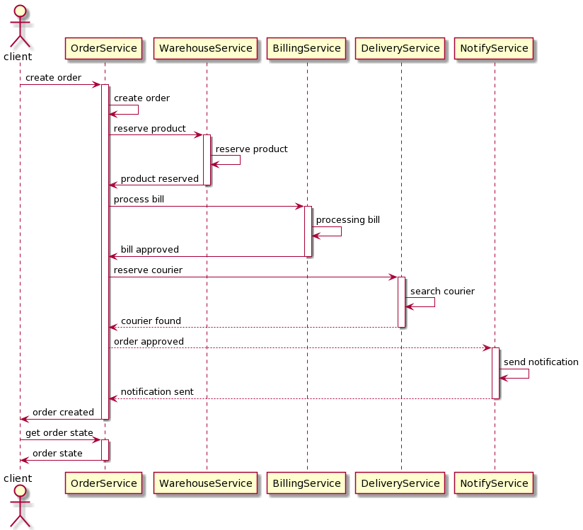
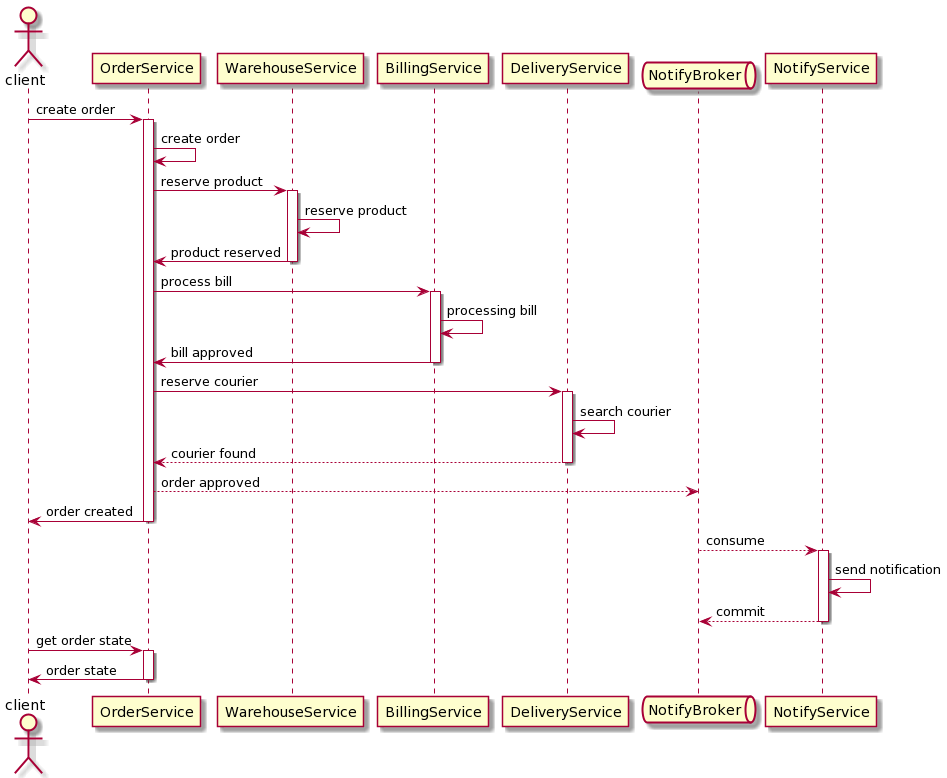
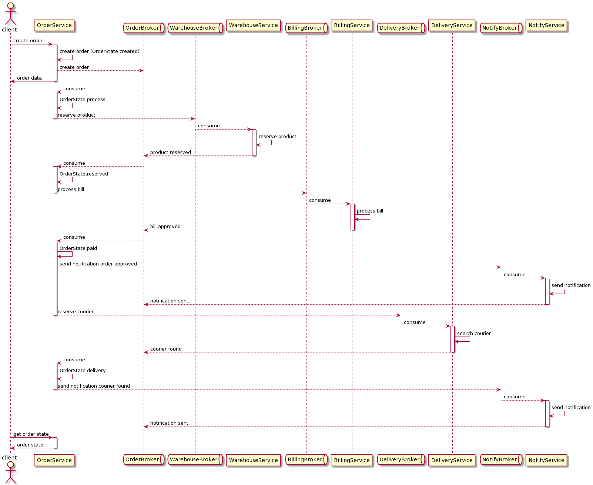
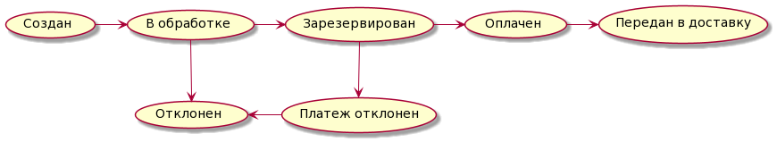

# Сервисное взаимодействие

## Обзор на 3 типа взаимодействия

1) Только HTTP взаимодействие
2) Событийное взаимодействие с использование брокера сообщений для нотификаций (уведомлений)
3) Event Collaboration - cтиль взаимодействия с использованием брокера сообщений

### Только HTTP взаимодействие

### Событийное взаимодействие с использование брокера сообщений для нотификаций (уведомлений)

### Event Collaboration - cтиль взаимодействия с использованием брокера сообщений

## Выбор Event Collaboration

### Saga orchestration

#### States

#### Flow

| Этап	| Сервис		| Транзакция	| Компенсирующая транзация	| Комментарий				|
| ------|:-------------:|:-------------:|:-------------------------:|:-------------------------:|
| 1		|Order			|process order	| reject order				| Компенсируемая транзация	|
| 1		|Warehouse		|reserve product| reject reserve product	| Компенсируемая транзация	|
| 2		|Billing		|process bill	| -							| Поворотная транзация		|
| 3		|Notification	|send message	| -							| Повторяемая транзация		|
| 4		|Delivery		|find courier	| -							| Повторяемая транзация		|
| 5		|Notification	|send message	| -							| Повторяемая транзация		|

